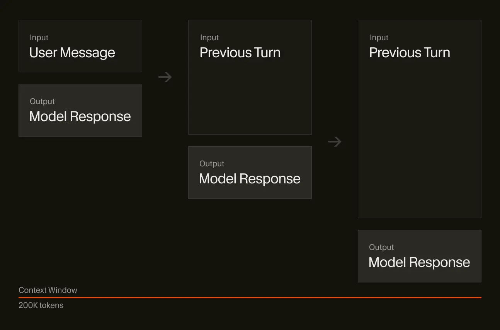

<MuxPlayer playbackId="ecriU3JRk4stxv4g1jf6sZ7w501krfJAtqWQgy4ywiJM" />

# Context

Now that you understand how AI models work, let’s explore how we can improve the quality of their output.

You might think to improve the model output you need to write better prompts. And that will certainly help, but it’s missing the bigger point: working with AI models is all about managing the context you provide it.

You can think about this like cooking. Let’s say we’re making a soup.

You have many inputs into the cooking process with all of the ingredients. You follow some path or recipe, keeping track of your progress along the way. And at the end, you have a tasty soup as a result.

Different chefs might add or modify the ingredients to their taste, and even if you follow the same recipe exactly, it might taste slightly different at the end.

This is kind of like working with AI models! Let’s look at a similar example for coding:

1. You can have many inputs, like your current codebase and files, and a prompt to tell the AI model what you want to achieve
2. You follow a plan, sometimes human generated or suggested by the model itself, which can then create a todo list and check items off as it completes tasks
3. And the end, you get generated code you can apply to your project

## System and user prompts

Your inputs, as well as the model outputs, all become part of the “context”. Think of the context like a long list, where the AI model keeps a working memory for the conversation.

At the start of the list is a system prompt. This is how the tool creator can inject some instructions or style for the model to follow. It’s trying to help nudge the output in a certain direction, including defining specific rules to follow.

Then you have the user message or prompt. This could be any directions you want to give the model. For example, adding a new route to manage user accounts. You don’t have to use proper spelling or grammar, as AI models are surprisingly good at figuring out what you meant, but it still can’t hurt.

This doesn’t have to be just text. Many AI products now support attaching images, where the underlying AI model can read and understand the contents of the image and include that text representation in the context.

Which items are part of the model’s context during a chat?
Select all that apply

System prompt

The existing conversation history

Attached files and tool outputs

Your API key string
Check
Reset

## Including context

Tools like Cursor can automatically include other relevant information in the input context based on the state of your codebase. For example, your open files, the output from your terminal, linter errors, and more.

For example, try the prompt below. It will include the current file we're viewing, which is the page you're reading right now.

<Woz
title='Recap'
description='Run a prompt and enable tokenizer view'
prompt='What are some tips for providing better context when working with AI coding assistants?'
/>

After sending the inputs to the model, it generates and returns some output back. For simple questions, this might just be text. For coding use cases, this could be snippets of code to apply to your codebase. Everything returned from the model is part of the output context.

Your conversation may go on for many “turns” back and forth between you and the AI model. Every message in the conversation, including both inputs and outputs, is stored as part of the working memory in context.

The length of this list grows over time. This is important to note! Just like if you were having a conversation with a human, there’s only so much context you can keep in your brain at one time.

As the conversation goes on for a while, it gets harder to remember things people might have said 3 hours ago. This is why understanding and managing context will be an important skill to learn.

## Context limits

Every AI model also has a different context limit, where it will no longer accept further messages in the conversation, so many AI tools give the user feedback on how close they are to those limits or provide ways to compress and summarize the current conversation to stay under the limit.

How adding more turns grows the context window of a conversation
Later on in the course, we’ll cover practical examples for how to manage context inside of Cursor. So far we’ve only talked about how we can give the model context we control, like text or images. What about if we want the model to dynamically retrieve context itself?

That’s where tool calling comes in.
